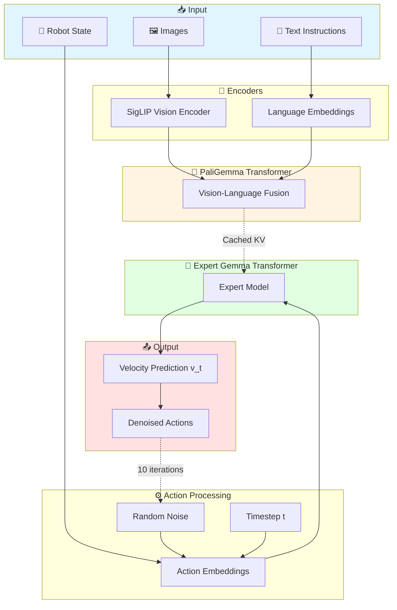
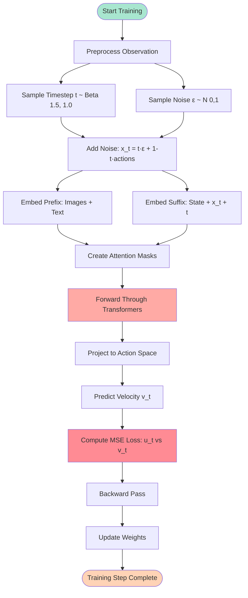
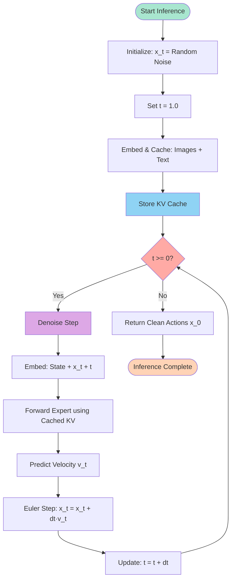
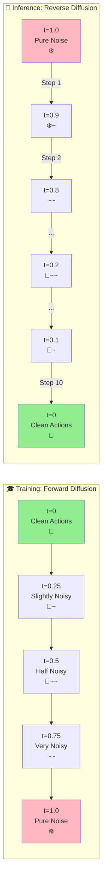
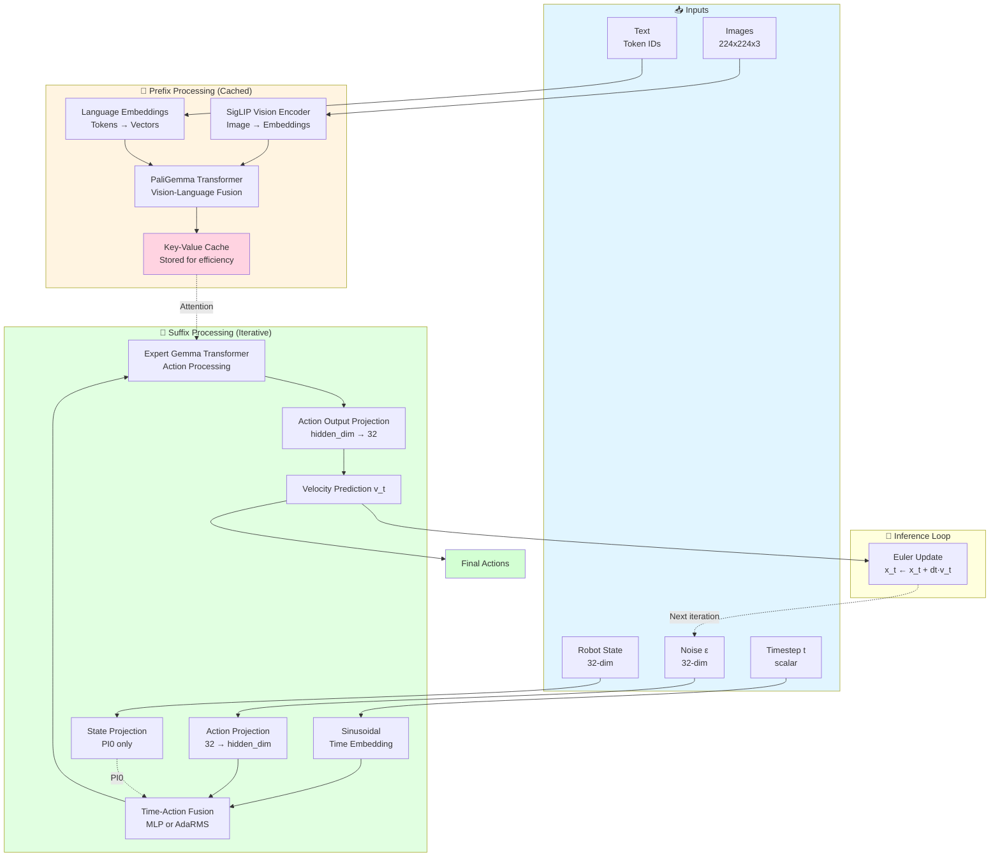

# PI0 PyTorch Architecture Explanation

## Overview: What This Model Does

This is a **diffusion-based robot control model** that learns to predict robot actions from:
- **Images** (what the robot sees)
- **Text instructions** (what the robot should do)
- **Robot state** (current joint positions)

The model uses a diffusion process to generate smooth, realistic action sequences by starting with random noise and gradually refining it into meaningful robot commands.

### High-Level Architecture Diagram



---

## Main Architecture Components

### 1. PI0Pytorch (Main Model)

Located in: `src/openpi/models_pytorch/pi0_pytorch.py`

The main container class that holds:
- **PaliGemma + Expert**: A vision-language model that understands images and text
- **Action projections**: Converts actions to/from the model's internal format (32 dimensions)
- **Time MLPs**: Handles the timestep information for the diffusion process

```python
class PI0Pytorch(nn.Module):
    def __init__(self, config):
        # Core components
        self.paligemma_with_expert = PaliGemmaWithExpertModel(...)
        self.action_in_proj = nn.Linear(32, action_expert_config.width)
        self.action_out_proj = nn.Linear(action_expert_config.width, 32)
        
        # Time conditioning (differs between PI0 and PI0.5)
        if self.pi05:
            self.time_mlp_in = nn.Linear(...)
            self.time_mlp_out = nn.Linear(...)
        else:
            self.state_proj = nn.Linear(32, action_expert_config.width)
            self.action_time_mlp_in = nn.Linear(...)
            self.action_time_mlp_out = nn.Linear(...)
```

**Two Variants:**
- **PI0**: Concatenates time embeddings directly with action embeddings
- **PI0.5**: Uses Adaptive RMS normalization (AdaRMS) with time conditioning for better control

### 2. The Two-Transformer Architecture

PI0 uses **two separate transformer models** configured by `paligemma_variant` and `action_expert_variant` in the config:

**PaliGemma (2B parameters)** - `paligemma_variant: "gemma_2b"`
- Processes vision and language inputs (images + text instructions)
- Runs **once** during inference to create contextual understanding
- Output is cached in key-value pairs for efficiency

**Action Expert (300M parameters)** - `action_expert_variant: "gemma_300m"`
- Processes robot state and noisy actions
- Runs **10+ times** during iterative denoising (diffusion sampling)
- Uses cached PaliGemma outputs for context

**Why Two Models?**

The action expert is intentionally smaller because it runs multiple times per prediction:
```
Inference cost = 1× PaliGemma (2B) + 10× Action Expert (300M) = 5B param forward passes

If action expert was 2B: 1× (2B) + 10× (2B) = 22B param forward passes (4.4× slower!)
```

This design enables **real-time robot control** by keeping the iterative denoising loop lightweight while maintaining a powerful vision-language understanding model.

---

## How It Works: The Pipeline

### Training Process (`forward` method)

The training forward pass follows these steps:

1. **Preprocess Observations**
   - Extract images, image masks, language tokens, language masks, and robot state

2. **Add Noise to Actions (Diffusion)**
   ```python
   # Sample random timestep t ∈ [0, 1]
   time = sample_beta(1.5, 1.0, batch_size)
   
   # Mix actions with noise based on timestep
   x_t = t * noise + (1 - t) * actions
   u_t = noise - actions  # Target to predict
   ```

3. **Embed Inputs**
   - **Prefix (Context)**: Images + text instructions
   - **Suffix (Actions)**: Robot state + noisy actions + timestep

4. **Create Attention Masks**
   - Control which parts of the input can "see" each other
   - Images/text use bidirectional attention
   - Actions use causal attention (can only see previous actions)

5. **Pass Through Transformer**
   - PaliGemma processes the prefix (vision + language)
   - Expert Gemma processes the suffix (state + actions)
   - Both work together with proper attention masking

6. **Predict the Noise**
   ```python
   v_t = action_out_proj(suffix_out)
   loss = MSE(u_t, v_t)  # Compare predicted vs actual noise
   ```

**Key Insight:** The model learns to predict `noise - actions`, which tells it how to remove noise from noisy actions.

#### Training Process Flowchart



---

### Inference Process (`sample_actions` method)

The inference process generates actions by iteratively denoising:

1. **Start with Pure Noise**
   ```python
   x_t = random_noise()  # Random initial actions
   time = 1.0  # Start at t=1 (pure noise)
   ```

2. **Process Images/Text Once**
   - Embed and cache the vision-language features for efficiency
   - These don't change during the denoising steps

3. **Iteratively Denoise (10 steps)**
   ```python
   dt = -1.0 / num_steps
   while time >= 0:
       # Predict velocity (how to remove noise)
       v_t = denoise_step(state, x_t, time)
       
       # Update using Euler integration
       x_t = x_t + dt * v_t
       time += dt
   ```

4. **Return Clean Actions**
   - After 10 steps, x_t contains the predicted robot actions

**Analogy:** Like painting - start with random scribbles and gradually refine into a clear picture!

#### Inference Process Flowchart



---

## Key Helper Functions

### 1. Embedding Functions

#### `embed_prefix` - Vision & Language Embeddings

Processes the context (what the robot sees and should do):

```python
def embed_prefix(images, img_masks, lang_tokens, lang_masks):
    # 1. Embed images using SigLIP vision encoder
    for img, img_mask in images:
        img_emb = paligemma_with_expert.embed_image(img)
        embs.append(img_emb)
        att_masks += [0] * num_image_tokens  # Bidirectional attention
    
    # 2. Embed language tokens
    lang_emb = embed_language_tokens(lang_tokens)
    lang_emb = lang_emb * sqrt(embedding_dim)  # Scale by sqrt(d)
    embs.append(lang_emb)
    att_masks += [0] * num_lang_tokens  # Bidirectional attention
    
    return embs, pad_masks, att_masks
```

**What it does:** Converts raw images and text into vector representations that the transformer can process.

#### `embed_suffix` - State, Actions & Time Embeddings

Processes the actions and robot state:

```python
def embed_suffix(state, noisy_actions, timestep):
    # 1. Embed robot state (only in PI0, not PI0.5)
    if not self.pi05:
        state_emb = state_proj(state)
        att_masks += [1]  # Causal boundary
    
    # 2. Create time embeddings using sinusoidal encoding
    time_emb = create_sinusoidal_pos_embedding(
        timestep, dimension, min_period=4e-3, max_period=4.0
    )
    
    # 3. Embed and fuse actions with time
    action_emb = action_in_proj(noisy_actions)  # [B, H, 32] → [B, H, D]
    
    if not self.pi05:
        # PI0: Concatenate time with actions
        time_emb = expand(time_emb)  # [B, D] → [B, H, D] (repeat for each action)
        action_time_emb = concat([action_emb, time_emb])  # → [B, H, 2D]
        action_time_emb = MLP(action_time_emb)  # [B, H, 2D] → [B, H, D]
        adarms_cond = None  # No adaptive normalization
    else:
        # PI0.5: Use time for AdaRMS conditioning (DiT-inspired)
        adarms_cond = time_mlp_in(time_emb)  # [B, D] → [B, D]
        adarms_cond = SiLU(adarms_cond)      # First activation
        adarms_cond = time_mlp_out(adarms_cond)  # [B, D] → [B, D]
        adarms_cond = SiLU(adarms_cond)      # Second activation (double SiLU!)
        action_time_emb = action_emb  # Keep actions separate [B, H, D]
    
    att_masks += [1] + [0] * (action_horizon - 1)  # Causal attention
    
    return embs, pad_masks, att_masks, adarms_cond
```

**What it does:** Prepares action and state information for the transformer, incorporating time information for diffusion.

**Key Difference in Time Handling:**

The fundamental difference between PI0 and PI0.5 is **how they inject time information**:

- **PI0 (Concatenation approach):** 
  - Time is **directly fused** with action embeddings through concatenation and MLP
  - Time information becomes part of the token embeddings themselves
  - Shape transformation: `[B, H, D] + [B, H, D] → [B, H, 2D] → [B, H, D]`
  - Simpler but less flexible

- **PI0.5 (Conditioning approach - DiT-inspired):**
  - Time is processed separately and used to **modulate** the transformer's normalization layers
  - Action embeddings remain "clean" - time affects how they're processed, not the embeddings themselves
  - Double SiLU activation: `time → MLP → SiLU → MLP → SiLU → conditioning`
  - More parameter-efficient and allows dynamic adaptation based on noise level
  - Inspired by Diffusion Transformer (DiT) and modern diffusion architectures

**Why Double SiLU in PI0.5?**
The double activation (`SiLU → Linear → SiLU`) creates a more expressive conditioning signal that can better capture the complex relationship between timestep and how the model should denoise at that particular noise level.

---

### 2. Attention Masks (`make_att_2d_masks`)

Creates 2D attention masks that control what each token can attend to:

```python
def make_att_2d_masks(pad_masks, att_masks):
    # cumsum creates boundaries for causal attention
    cumsum = torch.cumsum(att_masks, dim=1)
    
    # Token i can attend to token j if cumsum[j] <= cumsum[i]
    att_2d_masks = cumsum[:, None, :] <= cumsum[:, :, None]
    
    # Combine with padding masks
    pad_2d_masks = pad_masks[:, None, :] * pad_masks[:, :, None]
    return att_2d_masks & pad_2d_masks
```

**Examples:**
- `[0 0 0 1 1 1]` = Prefix-LM attention (first 3 tokens bidirectional, last 3 causal)
- `[1 1 1 1 1 1]` = Pure causal attention (each token only sees previous)
- `[0 0 0 0]` = Bidirectional attention (all tokens see each other)

**In PI0:**
- Images & text: `[0 0 0 0]` (bidirectional)
- State & actions: `[1 0 0 0]` (causal, with boundary at state)

#### Attention Mask Visualization

```
PI0 Attention Pattern:
═══════════════════════════════════════════════════════════════

        Image Tokens    Lang Tokens    State    Action Tokens
        [I1][I2][I3]    [L1][L2][L3]   [S]     [A1][A2][A3]
        ─────────────────────────────────────────────────────────
[I1]    ✓   ✓   ✓       ✓   ✓   ✓      ✗       ✗   ✗   ✗
[I2]    ✓   ✓   ✓       ✓   ✓   ✓      ✗       ✗   ✗   ✗
[I3]    ✓   ✓   ✓       ✓   ✓   ✓      ✗       ✗   ✗   ✗
        ─────────────────────────────────────────────────────────
[L1]    ✓   ✓   ✓       ✓   ✓   ✓      ✗       ✗   ✗   ✗
[L2]    ✓   ✓   ✓       ✓   ✓   ✓      ✗       ✗   ✗   ✗
[L3]    ✓   ✓   ✓       ✓   ✓   ✓      ✗       ✗   ✗   ✗
        ─────────────────────────────────────────────────────────
[S]     ✓   ✓   ✓       ✓   ✓   ✓      ✓       ✗   ✗   ✗
        ─────────────────────────────────────────────────────────
[A1]    ✓   ✓   ✓       ✓   ✓   ✓      ✓       ✓   ✗   ✗
[A2]    ✓   ✓   ✓       ✓   ✓   ✓      ✓       ✓   ✓   ✗
[A3]    ✓   ✓   ✓       ✓   ✓   ✓      ✓       ✓   ✓   ✓

Legend:
✓ = Can attend to (visible)
✗ = Cannot attend to (masked)

Key Properties:
• Images & Language: Full bidirectional attention (prefix)
• State: Can see all prefix, but prefix cannot see state
• Actions: Causal attention (each action sees only previous actions)
• Prefix tokens cannot see suffix tokens (maintains causality)
```

---

### 3. Time Embeddings (`create_sinusoidal_pos_embedding`)

Encodes the diffusion timestep using sinusoidal functions:

```python
def create_sinusoidal_pos_embedding(time, dimension, min_period, max_period):
    # Create frequencies from min to max period
    fraction = linspace(0, 1, dimension // 2)
    period = min_period * (max_period / min_period) ** fraction
    
    # Compute sin and cos at different frequencies
    scaling = 2π / period
    sin_input = scaling * time
    
    return concat([sin(sin_input), cos(sin_input)])
```

**Why sinusoidal?** Different frequencies capture different time scales, similar to positional encodings in transformers.

---

### 4. Denoising Step (`denoise_step`)

Performs one step of the denoising process during inference:

```python
def denoise_step(state, prefix_pad_masks, past_key_values, x_t, timestep):
    # 1. Embed current noisy actions with timestep
    suffix_embs, suffix_pad_masks, suffix_att_masks, adarms_cond = \
        embed_suffix(state, x_t, timestep)
    
    # 2. Create attention masks (prefix can be seen, suffix is causal)
    full_att_masks = create_causal_masks(prefix_pad_masks, suffix_pad_masks)
    
    # 3. Forward through expert model (reusing cached prefix)
    suffix_out, _ = paligemma_with_expert.forward(
        attention_mask=full_att_masks,
        past_key_values=past_key_values,  # Cached vision+language
        inputs_embeds=[None, suffix_embs],
        adarms_cond=[None, adarms_cond]
    )
    
    # 4. Project to action space
    v_t = action_out_proj(suffix_out)
    
    return v_t  # Velocity: how to remove noise
```

**Efficiency trick:** The vision and language embeddings are cached after the first pass, so only actions need to be processed in each denoising step.

---

## The Diffusion Process

### Forward Diffusion (Training)

Gradually adds noise to clean actions:

```
t=0: x_0 = clean_actions (real robot actions)
t=0.5: x_t = 0.5 * noise + 0.5 * actions (half noisy)
t=1: x_1 = pure noise (random)
```

**Formula:** `x_t = t * noise + (1 - t) * actions`

### Reverse Diffusion (Inference)

Gradually removes noise to recover actions:

```
t=1: x_1 = pure noise (random starting point)
      ↓ denoise_step predicts velocity v_t
t=0.9: x_t = x_t + dt * v_t
      ↓ denoise_step
t=0.8: ...
      ↓ repeat 10 times
t=0: x_0 = clean actions (predicted robot actions)
```

**Integration:** Uses simple Euler integration: `x_{t+dt} = x_t + dt * v_t`

### Diffusion Timeline Visualization



**Visual Guide:**
- 🎯 = Clean, structured actions
- ~ = Small amount of noise
- ❄️ = Pure random noise

```
Diffusion Process Detail:
═══════════════════════════════════════════════════════════════

TRAINING (Add Noise):
─────────────────────
t=0.0   ████████████████  Clean actions (ground truth)
t=0.2   ███████████▒▒▒▒▒  20% noise, 80% signal
t=0.5   ████████▒▒▒▒▒▒▒▒  50% noise, 50% signal
t=0.8   ███▒▒▒▒▒▒▒▒▒▒▒▒▒  80% noise, 20% signal
t=1.0   ▒▒▒▒▒▒▒▒▒▒▒▒▒▒▒▒  Pure noise

INFERENCE (Remove Noise):
─────────────────────────
t=1.0   ▒▒▒▒▒▒▒▒▒▒▒▒▒▒▒▒  Start: Pure noise
  ↓ Denoise step 1 (predict velocity, update)
t=0.9   █▒▒▒▒▒▒▒▒▒▒▒▒▒▒▒  Slightly less noisy
  ↓ Denoise step 2
t=0.8   ██▒▒▒▒▒▒▒▒▒▒▒▒▒▒  Continuing...
  ↓ ... (8 more steps)
t=0.1   █████████████▒▒▒  Almost clean
  ↓ Final step
t=0.0   ████████████████  Clean predicted actions

Formula: x_t = t·noise + (1-t)·actions
Where:  t ∈ [0,1]
        t=0 → clean
        t=1 → noisy
```

---

## Model Architecture Flow

### Detailed Component Diagram



### Data Flow Summary

```
┌─────────────────────────────────────────────────────────────────┐
│                     EMBEDDING STAGE                             │
├─────────────────────────────────────────────────────────────────┤
│                                                                 │
│  Images (B, H, W, 3)                                           │
│     ↓ SigLIP Vision Encoder                                    │
│  Image Embeddings (B, N_img, D)                                │
│                                                                 │
│  Text Tokens (B, N_text)                                       │
│     ↓ Language Embedding Layer                                 │
│  Text Embeddings (B, N_text, D) * sqrt(D)                     │
│                                                                 │
│  State (B, 32) [PI0 only]                                      │
│     ↓ Linear Projection                                        │
│  State Embeddings (B, 1, D)                                    │
│                                                                 │
│  Noisy Actions (B, H, 32)                                      │
│     ↓ Linear Projection                                        │
│  Action Embeddings (B, H, D)                                   │
│                                                                 │
│  Timestep (B,)                                                 │
│     ↓ Sinusoidal Encoding                                      │
│  Time Embeddings (B, D)                                        │
│                                                                 │
└─────────────────────────────────────────────────────────────────┘

┌─────────────────────────────────────────────────────────────────┐
│                   TRANSFORMER STAGE                             │
├─────────────────────────────────────────────────────────────────┤
│                                                                 │
│  Prefix: [Image Embs | Text Embs]                             │
│     ↓ PaliGemma Transformer                                    │
│  Prefix Features + KV Cache                                    │
│                                                                 │
│  Suffix: [State Emb | Action+Time Embs] [PI0]                 │
│     or:  [Action Embs] + Time Conditioning [PI0.5]            │
│     ↓ Expert Gemma Transformer (uses Prefix KV Cache)         │
│  Action Features (B, H, D)                                     │
│                                                                 │
└─────────────────────────────────────────────────────────────────┘

┌─────────────────────────────────────────────────────────────────┐
│                     OUTPUT STAGE                                │
├─────────────────────────────────────────────────────────────────┤
│                                                                 │
│  Action Features (B, H, D)                                     │
│     ↓ Linear Projection                                        │
│  Velocity Prediction v_t (B, H, 32)                           │
│     ↓ Euler Integration [Inference only]                       │
│  Updated Actions x_t ← x_t + dt·v_t                           │
│                                                                 │
└─────────────────────────────────────────────────────────────────┘

Legend:
  B = Batch size
  H = Action horizon (number of future action steps)
  D = Hidden dimension (model width)
  N_img = Number of image tokens
  N_text = Number of text tokens
```

### Time Conditioning Data Flow Comparison

```
PI0 TIME CONDITIONING FLOW:
═══════════════════════════════════════════════════════════════════

Timestep t          Action Embeddings
   [B]                   [B, H, 32]
    │                         │
    ↓                         ↓
Sinusoidal              action_in_proj
Encoding                     │
    │                        │
    ↓                        ↓
[B, D] ────────────►    [B, H, D]
    │                        │
    │ Expand to              │
    │ [B, H, D]              │
    │ (repeat H times)       │
    │                        │
    └───────┬────────────────┘
            │
            ↓
      Concatenate along
       dimension -1
            │
            ↓
        [B, H, 2D]
            │
            ↓
    action_time_mlp_in
            │
            ↓
         SiLU
            │
            ↓
    action_time_mlp_out
            │
            ↓
        [B, H, D]
     (time BAKED IN)
            │
            ↓
   Standard Transformer
   (Regular RMSNorm)
            │
            ↓
       Velocity v_t


PI0.5 TIME CONDITIONING FLOW:
═══════════════════════════════════════════════════════════════════

Timestep t          Action Embeddings
   [B]                   [B, H, 32]
    │                         │
    ↓                         ↓
Sinusoidal              action_in_proj
Encoding                     │
    │                        │
    ↓                        ↓
  [B, D]                 [B, H, D]
    │                        │
    ↓                        │
time_mlp_in                  │
    │                        │
    ↓                        │
  SiLU (1st)                 │
    │                        │
    ↓                        │
time_mlp_out                 │
    │                        │
    ↓                        │
  SiLU (2nd)                 │
    │                        │
    ↓                        │
  [B, D]                     │
adarms_cond                  │
    │                        │
    └───────────┬────────────┘
                │ (separate paths)
                │
                ↓
    AdaRMS Transformer
    (Time modulates normalization)
         ┌──────────┐
         │  Layer 1 │
         │ AdaRMS(x, time_cond) │
         └──────────┘
         ┌──────────┐
         │  Layer 2 │
         │ AdaRMS(x, time_cond) │
         └──────────┘
              ...
                │
                ↓
          Velocity v_t


KEY INSIGHT:
───────────
PI0:   Time → Expand → Concat → MLP → Fused Embeddings
       (Time is PART OF the embeddings)

PI0.5: Time → Double MLP → Conditioning Signal
       (Time MODULATES how embeddings are processed)

Shape Changes:
──────────────
PI0:   time [B,D] → expand [B,H,D] → concat [B,H,2D] → MLP [B,H,D]
PI0.5: time [B,D] → MLP [B,D] → stays [B,D] (broadcasts to condition all H steps)
```

---

## Key Design Choices

### 1. Why Diffusion?

- **Multimodal outputs:** Can generate diverse action sequences
- **Smooth actions:** Iterative refinement produces smooth trajectories
- **Stable training:** Easier to train than autoregressive or one-shot prediction

### 2. Why Separate PaliGemma and Expert?

- **PaliGemma:** Pre-trained on vision-language tasks (frozen or fine-tuned)
- **Expert:** Specialized for action prediction (always trained)
- **Efficiency:** Can cache vision-language features during inference

### 3. Why Causal Attention for Actions?

- **Autoregressive structure:** Each action step depends on previous steps
- **Temporal coherence:** Enforces temporal dependencies in action sequences

### 4. PI0 vs PI0.5 Differences

| Feature | PI0 | PI0.5 |
|---------|-----|-------|
| Time conditioning | Concatenation + MLP fusion | AdaRMS (Adaptive RMSNorm) |
| State embedding | Separate token in suffix | Not used (in prefix instead) |
| Normalization | Standard RMSNorm | Adaptive RMSNorm |
| Time MLP activation | Single SiLU | Double SiLU |
| Action-time fusion | Concatenate then fuse | Keep separate, condition via normalization |
| Performance | Good | Better |
| Inspiration | Standard diffusion | Modern diffusion (DiT-style) |

**AdaRMS (Adaptive RMS normalization):** Conditions the normalization on timestep, allowing the model to adapt its behavior based on how noisy the input is. This is inspired by modern diffusion models like DiT (Diffusion Transformer) where time conditioning modulates normalization layers dynamically rather than being directly concatenated with inputs.

#### PI0 vs PI0.5 Architecture Comparison

```mermaid
graph TB
    subgraph PI0["PI0 Architecture"]
        P0_STATE[Robot State]
        P0_ACTIONS[Noisy Actions]
        P0_TIME[Timestep]
        
        P0_STATE --> P0_STATE_PROJ[Linear Projection]
        P0_ACTIONS --> P0_ACTION_PROJ[Linear Projection]
        P0_TIME --> P0_TIME_EMB[Sinusoidal Embedding]
        
        P0_ACTION_PROJ --> P0_CONCAT[Concatenate]
        P0_TIME_EMB --> P0_CONCAT
        P0_CONCAT --> P0_MLP[MLP<br/>SiLU activation]
        
        P0_STATE_PROJ --> P0_TOKENS[Token Sequence]
        P0_MLP --> P0_TOKENS
        
        P0_TOKENS --> P0_EXPERT[Expert Transformer<br/>Standard Normalization]
        P0_EXPERT --> P0_OUT[Output]
    end
    
    subgraph PI05["PI0.5 Architecture"]
        P5_ACTIONS[Noisy Actions]
        P5_TIME[Timestep]
        
        P5_ACTIONS --> P5_ACTION_PROJ[Linear Projection]
        P5_TIME --> P5_TIME_MLP[Time MLP<br/>Double SiLU]
        
        P5_ACTION_PROJ --> P5_EXPERT[Expert Transformer<br/>AdaRMS Normalization]
        P5_TIME_MLP -.Conditioning.-> P5_EXPERT
        
        P5_EXPERT --> P5_OUT[Output]
    end
    
    style PI0 fill:#ffe1e1
    style PI05 fill:#e1ffe1
    style P0_CONCAT fill:#ffcccc
    style P5_TIME_MLP fill:#ccffcc
```



**Key Differences:**

```
PI0 Approach (Concatenation + Fusion):
═══════════════════════════════════════════════════════════
┌──────────────┐     ┌──────────────┐
│ State (32)   │────►│ Projection   │─┐
└──────────────┘     └──────────────┘ │
                     [B, 1, D]        ├──► [S | A₁ | A₂ | ...]
┌──────────────┐     ┌──────────────┐ │
│ Action       │────►│ Projection   │─┤
│ [B, 50, 32]  │     │ [B, 50, D]   │ │
└──────────────┘     └──────────────┘ │
                                       │
┌──────────────┐     ┌──────────────┐ │
│ Time (t)     │────►│ Sinusoidal   │ │
│ [B]          │     │ [B, D]       │ │
└──────────────┘     └──────────────┘ │
                            │          │
                            ▼          │
                    ┌──────────────┐  │
                    │ Expand Time  │  │
                    │ [B, 50, D]   │  │
                    └──────────────┘  │
                            │          │
                            ▼          │
                    ┌──────────────┐  │
                    │ Concatenate  │◄─┘
                    │ [B, 50, 2D]  │
                    └──────────────┘
                            │
                            ▼
                    ┌──────────────┐
                    │ MLP + SiLU   │
                    │ [B, 50, D]   │
                    └──────────────┘
                            │
                            ▼
                Standard Transformer
                (Regular RMSNorm)
                            │
                            ▼
                     Velocity v_t

Steps:
1. Expand time: [B, D] → [B, 50, D] (repeat for each action)
2. Concat: [B, 50, D] + [B, 50, D] → [B, 50, 2D]
3. MLP: action_time_mlp_in → SiLU → action_time_mlp_out
4. Result: [B, 50, D] action embeddings WITH time baked in
5. adarms_cond = None


PI0.5 Approach (Adaptive Normalization):
═══════════════════════════════════════════════════════════
┌──────────────┐     ┌──────────────┐
│ Action       │────►│ Projection   │───► [A₁ | A₂ | ...]
│ [B, 50, 32]  │     │ [B, 50, D]   │         │
└──────────────┘     └──────────────┘         │
                                               ▼
┌──────────────┐     ┌──────────────┐    AdaRMS Transformer
│ Time (t)     │────►│ Sinusoidal   │◄───────┤ (Time-conditioned)
│ [B]          │     │ [B, D]       │         │
└──────────────┘     └──────────────┘         │
                            │                  │
                            ▼                  │
                    ┌──────────────┐          │
                    │ time_mlp_in  │          │
                    │ [B, D]       │          │
                    └──────────────┘          │
                            │                  │
                            ▼                  │
                    ┌──────────────┐          │
                    │ SiLU (1st)   │          │
                    └──────────────┘          │
                            │                  │
                            ▼                  │
                    ┌──────────────┐          │
                    │ time_mlp_out │          │
                    │ [B, D]       │          │
                    └──────────────┘          │
                            │                  │
                            ▼                  │
                    ┌──────────────┐          │
                    │ SiLU (2nd)   │          │
                    └──────────────┘          │
                            │                  │
                     adarms_cond ──────────────┘
                     [B, D]

Steps:
1. Time embedding: [B] → [B, D] (sinusoidal)
2. Double MLP: time_mlp_in → SiLU → time_mlp_out → SiLU
3. Actions stay separate: [B, 50, D] (NOT concatenated)
4. adarms_cond = processed_time [B, D]
5. Conditioning: Time modulates normalization in transformer layers

Advantages of PI0.5:
• No state token needed (simpler sequence)
• Time directly modulates layer normalization (DiT-inspired)
• Better handling of different noise levels
• More parameter-efficient conditioning
• Keeps action embeddings clean, modulates via normalization
• Double SiLU activation provides richer time conditioning
```

---

## Optimization Features

### Gradient Checkpointing

```python
def gradient_checkpointing_enable():
    # Saves memory by recomputing activations during backward pass
    self.paligemma_with_expert.paligemma.language_model.gradient_checkpointing = True
    self.paligemma_with_expert.paligemma.vision_tower.gradient_checkpointing = True
    self.paligemma_with_expert.gemma_expert.model.gradient_checkpointing = True
```

**Trade-off:** Reduces memory usage at the cost of increased computation time.

### Torch Compile

```python
self.sample_actions = torch.compile(self.sample_actions, mode="max-autotune")
```

**Benefit:** Automatically optimizes the inference loop for faster execution.

### KV Caching

During inference, vision and language features are computed once and cached:

```python
_, past_key_values = self.paligemma_with_expert.forward(
    inputs_embeds=[prefix_embs, None],
    use_cache=True  # Cache vision+language KV pairs
)

# Reuse in denoising steps
suffix_out, _ = self.paligemma_with_expert.forward(
    past_key_values=past_key_values,  # Reuse cached features
    inputs_embeds=[None, suffix_embs]
)
```

#### KV Caching Visualization

```mermaid
sequenceDiagram
    participant Obs as Observation
    participant Enc as Encoders
    participant Cache as KV Cache
    participant Loop as Denoising Loop
    participant Act as Actions
    
    Note over Obs,Cache: One-time Processing
    Obs->>Enc: Images + Text
    Enc->>Cache: Compute & Store Keys/Values
    
    Note over Loop: Iteration 1 (t=1.0)
    Loop->>Cache: Read cached KV
    Cache-->>Loop: Return prefix features
    Loop->>Loop: Process actions + time
    Loop->>Act: Update x_t
    
    Note over Loop: Iteration 2 (t=0.9)
    Loop->>Cache: Read cached KV (reuse!)
    Cache-->>Loop: Return prefix features
    Loop->>Loop: Process actions + time
    Loop->>Act: Update x_t
    
    Note over Loop: ... (8 more iterations)
    
    Note over Loop: Iteration 10 (t=0.1)
    Loop->>Cache: Read cached KV (reuse!)
    Cache-->>Loop: Return prefix features
    Loop->>Loop: Process actions + time
    Loop->>Act: Final actions
    
    Note over Obs,Act: ⚡ Speed: ~10x faster by caching prefix!
```

**Performance Impact:**
```
Without KV Caching:
  Step 1: Process [Image + Text + Actions] → 100 ms
  Step 2: Process [Image + Text + Actions] → 100 ms
  ...
  Step 10: Process [Image + Text + Actions] → 100 ms
  Total: ~1000 ms

With KV Caching:
  Initial: Process [Image + Text] → 50 ms + Cache
  Step 1: Process [Actions only] → 10 ms (use cache)
  Step 2: Process [Actions only] → 10 ms (use cache)
  ...
  Step 10: Process [Actions only] → 10 ms (use cache)
  Total: ~150 ms ⚡ (~6.7x speedup!)
```

---

## Utility Functions

### `sample_beta` - Time Sampling

```python
def sample_beta(alpha, beta, bsize, device):
    # Sample from Beta distribution for timesteps
    dist = torch.distributions.Beta(alpha=1.5, beta=1.0)
    return dist.sample((bsize,))
```

**Why Beta(1.5, 1.0)?** Biases toward higher timesteps (more noise), which helps the model learn to handle very noisy inputs.

### `get_safe_dtype` - Device Compatibility

```python
def get_safe_dtype(target_dtype, device_type):
    if device_type == "cpu" and target_dtype == torch.bfloat16:
        return torch.float32  # CPU doesn't support bfloat16
    return target_dtype
```

**Purpose:** Ensures compatibility across different hardware (CPU vs GPU).

---

## Summary

The PI0 architecture combines:

1. **Vision Understanding** (SigLIP) → Processes what the robot sees
2. **Language Understanding** (Gemma embeddings) → Processes instructions
3. **Vision-Language Fusion** (PaliGemma) → Connects perception with commands
4. **Action Generation** (Expert + Diffusion) → Produces smooth action sequences
5. **Time Conditioning** (Sinusoidal + MLPs) → Handles the denoising process

**Key Innovation:** Using diffusion for robot actions allows the model to iteratively refine its predictions, leading to smoother, more realistic robot movements.

**Two Variants:**
- **PI0:** Simpler, concatenates time with actions
- **PI0.5:** More sophisticated, uses adaptive normalization with time

This architecture enables robots to understand complex visual scenes and language instructions, then generate appropriate action sequences through an iterative denoising process.

### Complete System Overview

```mermaid
graph TB
    subgraph Training["🎓 TRAINING PHASE"]
        TR_OBS[Observation:<br/>Image + Text + State]
        TR_ACT[Ground Truth Actions]
        TR_NOISE[Sample Noise]
        TR_TIME[Sample Timestep t]
        
        TR_OBS --> TR_EMBED[Embed All Inputs]
        TR_ACT --> TR_MIX[Mix: x_t = t·noise + 1-t·actions]
        TR_NOISE --> TR_MIX
        TR_TIME --> TR_MIX
        
        TR_EMBED --> TR_TRANS[PaliGemma + Expert]
        TR_MIX --> TR_TRANS
        
        TR_TRANS --> TR_PRED[Predict velocity v_t]
        TR_PRED --> TR_LOSS[MSE Loss vs u_t = noise - actions]
        TR_LOSS --> TR_UPDATE[Update Model Weights]
    end
    
    subgraph Inference["🚀 INFERENCE PHASE"]
        INF_OBS[Observation:<br/>Image + Text + State]
        INF_NOISE[Pure Noise]
        
        INF_OBS --> INF_CACHE[Compute & Cache<br/>Vision-Language Features]
        INF_NOISE --> INF_LOOP[Denoising Loop]
        
        INF_CACHE -.KV Cache.-> INF_LOOP
        
        INF_LOOP --> INF_STEP1[Step 1: t=1.0 → t=0.9]
        INF_STEP1 --> INF_STEP2[Step 2: t=0.9 → t=0.8]
        INF_STEP2 --> INF_DOTS[...]
        INF_DOTS --> INF_STEP10[Step 10: t=0.1 → t=0.0]
        INF_STEP10 --> INF_FINAL[Clean Actions]
        INF_FINAL --> INF_ROBOT[Execute on Robot]
    end
    
    style Training fill:#ffe1e1
    style Inference fill:#e1ffe1
    style TR_LOSS fill:#ff8080
    style INF_CACHE fill:#80d4ff
    style INF_ROBOT fill:#80ff80
```



### Key Components Summary

```
┌─────────────────────────────────────────────────────────────────┐
│                      PI0 ARCHITECTURE                           │
└─────────────────────────────────────────────────────────────────┘

┌──────────────────┐
│  INPUT MODALITIES │
└──────────────────┘
   🖼️  Vision      → SigLIP Encoder → Image Embeddings
   💬 Language    → Gemma Embeddings → Text Embeddings
   🤖 State       → Linear Layer → State Embeddings (PI0 only)
   🎲 Actions     → Linear Layer → Action Embeddings
   ⏱️  Time       → Sinusoidal → Time Embeddings

┌──────────────────┐
│  CORE MODELS     │
└──────────────────┘
   🧠 PaliGemma   → Fuses vision + language understanding
   🎯 Expert      → Processes actions with context
   
┌──────────────────┐
│  KEY TECHNIQUES  │
└──────────────────┘
   🌊 Diffusion   → Iterative denoising for smooth actions
   🔄 Prefix-LM   → Bidirectional for context, causal for actions
   💾 KV Caching  → Compute vision/text once, reuse 10x
   🎚️  AdaRMS     → Time-conditioned normalization (PI0.5, DiT-inspired)
   🔀 Time Fusion → Concatenate+MLP (PI0) vs Modulate (PI0.5)

┌──────────────────┐
│  TRAINING        │
└──────────────────┘
   Input:  Clean actions + sampled noise
   Process: x_t = t·noise + (1-t)·actions
   Output: Predict velocity v_t = noise - actions
   Loss:   MSE(v_t, u_t)

┌──────────────────┐
│  INFERENCE       │
└──────────────────┘
   Input:  Pure noise (random)
   Process: 10 denoising steps with Euler integration
   Output: Clean robot actions
   Speed:  ~150ms per prediction (with optimizations)

┌──────────────────┐
│  OPTIMIZATION    │
└──────────────────┘
   ⚡ Torch Compile         → Faster inference loop
   💾 Gradient Checkpointing → Reduce memory usage
   🏃 KV Caching            → 6-7x speedup
```

---

## Quick Reference

### Model Variants

| Aspect | PI0 | PI0.5 |
|--------|-----|-------|
| **State Handling** | Separate token | Not used |
| **Time Integration** | Concatenate + MLP | AdaRMS conditioning |
| **Sequence Length** | Longer (includes state) | Shorter |
| **Normalization** | Standard RMSNorm | Adaptive RMSNorm |
| **Best For** | Understanding baseline | Production use |

### Dimensions & Shapes

```python
# Input dimensions
images:           (B, 224, 224, 3)          # RGB images
text_tokens:      (B, N_text)               # Tokenized instructions
state:            (B, 32)                   # Robot joint positions
actions:          (B, H, 32)                # Action sequences
timestep:         (B,)                      # Diffusion timestep

# Where:
#   B = Batch size
#   N_text = Number of text tokens (variable)
#   H = Action horizon (e.g., 16 future steps)

# Embedding dimensions
image_embeddings: (B, N_img, D)            # N_img ≈ 256-1024 tokens
text_embeddings:  (B, N_text, D)           # Scaled by sqrt(D)
state_embeddings: (B, 1, D)                # Single state token
action_embeddings:(B, H, D)                # Action sequence

# Where:
#   D = Model hidden dimension (e.g., 2048, 3072)
```

### Attention Pattern Reference

```
PREFIX (Image + Text):     Bidirectional ←→
SUFFIX (State + Actions):  Causal →→→
BOUNDARY:                  Prefix ⊐ Suffix (prefix cannot see suffix)
```

### Hyperparameters

```python
# Diffusion
num_inference_steps = 10                    # Denoising iterations
time_distribution = Beta(1.5, 1.0)         # Training time sampling
dt = -1.0 / num_steps                       # Step size

# Time embedding
min_period = 4e-3                           # Sinusoidal min period
max_period = 4.0                            # Sinusoidal max period

# Action space
action_dim = 32                             # Motors/joints
action_horizon = 16                         # Future steps to predict
```

---

## References

- **File**: `src/openpi/models_pytorch/pi0_pytorch.py`
- **Architecture**: PaliGemma (Vision-Language) + Expert Gemma (Action)
- **Training**: Diffusion with MSE loss on predicted velocity
- **Inference**: 10-step Euler integration for denoising
- **Base Models**: SigLIP (vision), Gemma (language & action)

