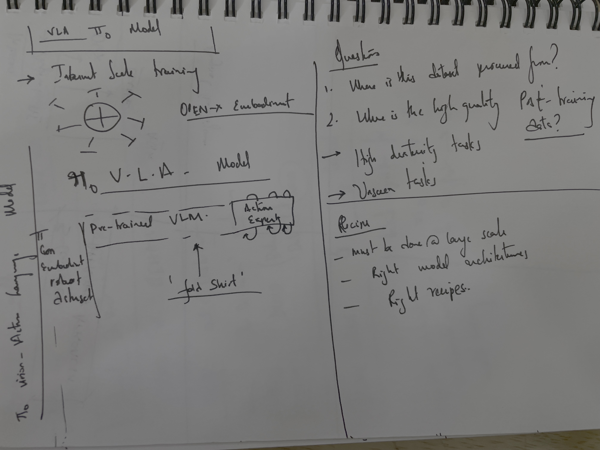
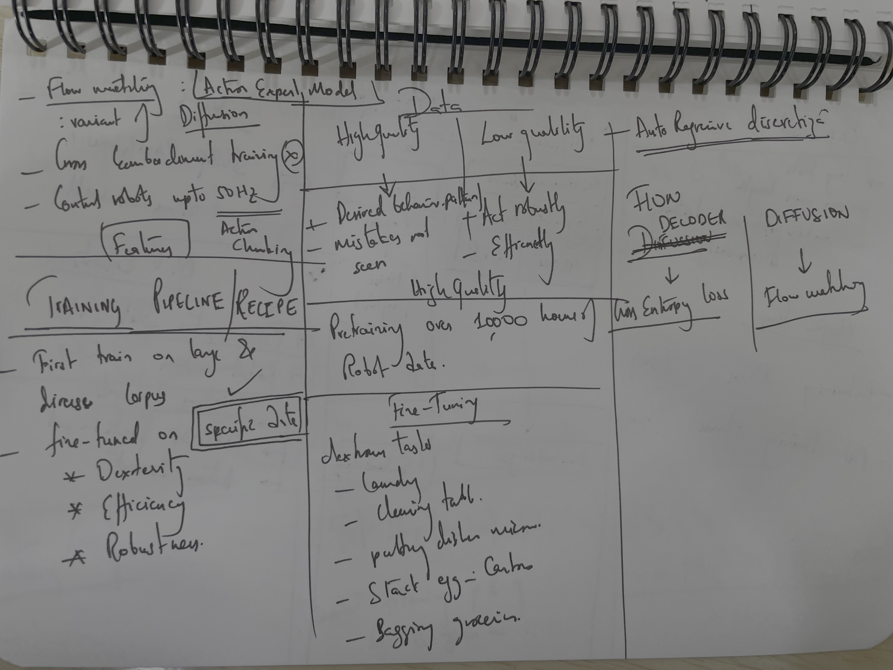
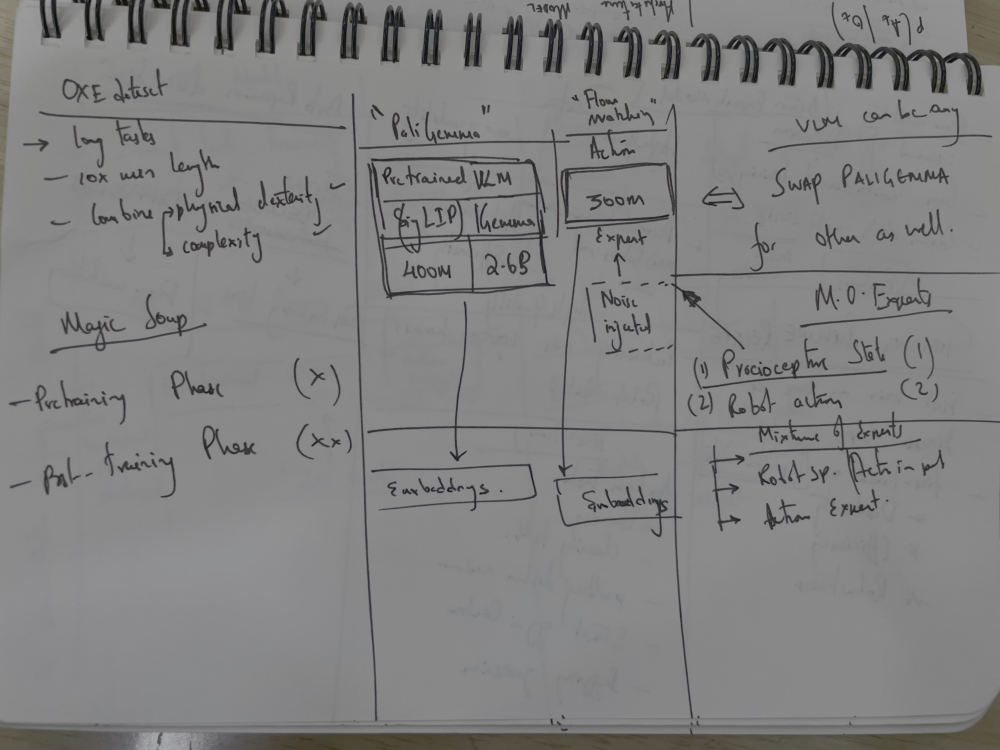
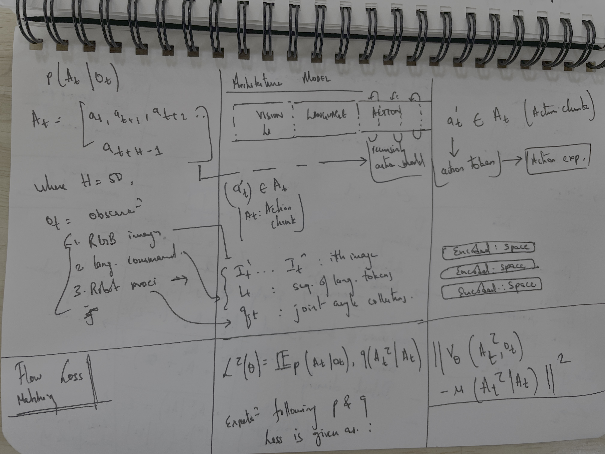
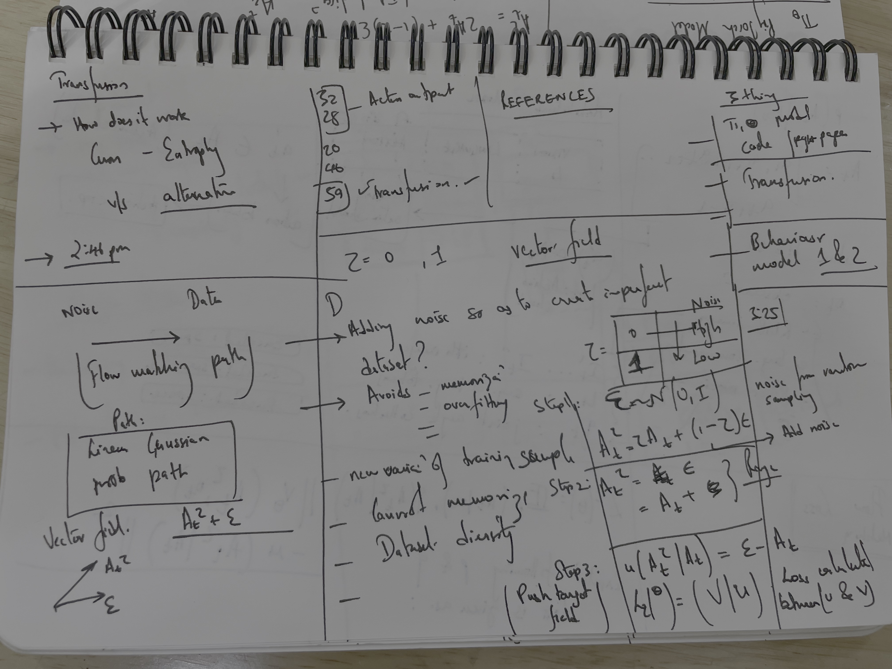
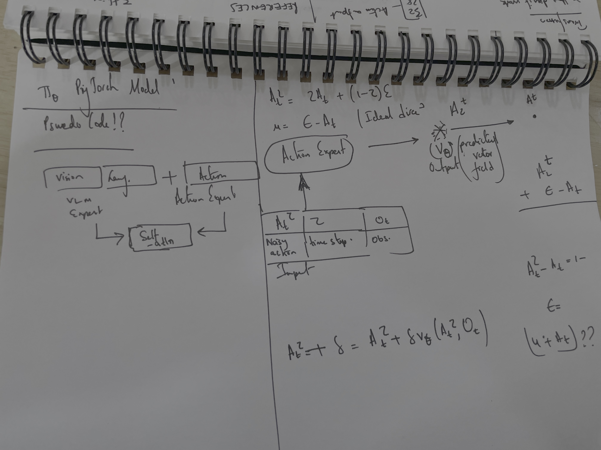

## Flow Matching Training Method

The content describes a method for training a network using flow matching, where the loss function is minimized:

$$L^T(\theta) = \mathbb{E}_{p(\mathbf{A}_t|\mathbf{o}_t), q(\mathbf{A}_t^\tau|\mathbf{A}_t)} \| v_\theta(\mathbf{A}_t^\tau, \mathbf{o}_t) - u(\mathbf{A}_t^\tau|\mathbf{A}_t) \|^2$$

Here, subscripts denote robot timesteps, superscripts denote flow matching timesteps ($\tau \in [0, 1]$), and the linear-Gaussian probability path is:

$$q(\mathbf{A}_t^\tau|\mathbf{A}_t) = \mathcal{N}(\tau \mathbf{A}_t, (1 - \tau) \mathbf{I})$$

### Training Process

The network is trained by:
1. Sampling random noise: $\epsilon \sim \mathcal{N}(0, \mathbf{I})$
2. Computing noisy actions: $\mathbf{A}_t^\tau = \tau \mathbf{A}_t + (1 - \tau) \epsilon$
3. Training the network to output $v_\theta(\mathbf{A}_t^\tau, \mathbf{o}_t)$ to match the denoising vector: $u(\mathbf{A}_t^\tau|\mathbf{A}_t) = \epsilon - \mathbf{A}_t$

A bidirectional attention mask is used, and $\tau$ is sampled from a beta distribution emphasizing lower (noisier) timesteps.

### Inference Process

At inference, actions are generated by integrating the learned vector field from $\tau = 0$ to $\tau = 1$ with random noise $\mathbf{A}_t^0 \sim \mathcal{N}(0, \mathbf{I})$ using forward Euler integration:

$$\mathbf{A}_t^{\tau + \delta} = \mathbf{A}_t^\tau + \delta v_\theta(\mathbf{A}_t^\tau, \mathbf{o}_t)$$

with $\delta = 0.1$ over 10 steps. Efficiency is improved by caching attention keys and values for the prefix $\mathbf{o}_t$.

